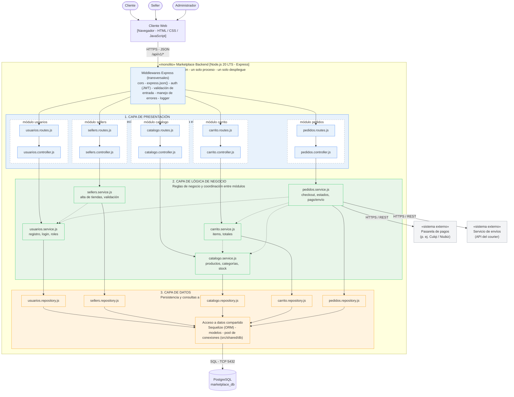

# Diagrama de Arquitectura - Marketplace Backend

A continuación se presenta el código de Mermaid que representa la arquitectura del monolito modular mostrada en el diagrama:

```mermaid
graph TB
    %% Definición de Actores
    Cliente([Cliente])
    Seller([Seller])
    Admin([Administrador])

    %% Cliente Web
    WebClient["Cliente Web<br>[Navegador - HTML / CSS / JavaScript]"]
    Cliente --> WebClient
    Seller --> WebClient
    Admin --> WebClient

    %% Sistema Central: Monolito
    subgraph Backend ["«monolito» Marketplace Backend [Node.js 20 LTS - Express]<br>Una sola aplicación - un solo proceso - un solo despliegue"]
        direction TB
        
        Middlewares["Middlewares Express (transversales)<br>cors - express.json() - auth (JWT) - validación de entrada - manejo de errores - logger"]

        %% Capa de Presentación
        subgraph Presentacion ["1. CAPA DE PRESENTACIÓN<br>Recibe peticiones HTTP, autentica, valida la entrada y responde JSON"]
            direction TB
            subgraph ModUsu ["módulo usuarios<br>src/modules/usuarios/"]
                UsuR[usuarios.routes.js] --> UsuC[usuarios.controller.js]
            end
            subgraph ModSel ["módulo sellers<br>src/modules/sellers/"]
                SelR[sellers.routes.js] --> SelC[sellers.controller.js]
            end
            subgraph ModCat ["módulo catalogo<br>src/modules/catalogo/"]
                CatR[catalogo.routes.js] --> CatC[catalogo.controller.js]
            end
            subgraph ModCar ["módulo carrito<br>src/modules/carrito/"]
                CarR[carrito.routes.js] --> CarC[carrito.controller.js]
            end
            subgraph ModPed ["módulo pedidos<br>src/modules/pedidos/"]
                PedR[pedidos.routes.js] --> PedC[pedidos.controller.js]
            end
        end

        %% Capa de Lógica de Negocio
        subgraph Logica ["2. CAPA DE LÓGICA DE NEGOCIO<br>Reglas de negocio y coordinación entre módulos"]
            direction TB
            UsuS["usuarios.service.js<br>registro, login, roles"]
            SelS["sellers.service.js<br>alta de tiendas, validación"]
            CatS["catalogo.service.js<br>productos, categorías, stock"]
            CarS["carrito.service.js<br>items, totales"]
            PedS["pedidos.service.js<br>checkout, estados, pago/envío"]
        end

        %% Capa de Datos
        subgraph Datos ["3. CAPA DE DATOS<br>Persistencia y consultas a la base de datos"]
            direction TB
            UsuRep[usuarios.repository.js]
            SelRep[sellers.repository.js]
            CatRep[catalogo.repository.js]
            CarRep[carrito.repository.js]
            PedRep[pedidos.repository.js]
            
            DBAccess["Acceso a datos compartido<br>Sequelize (ORM) - modelos - pool de conexiones (src/shared/db)"]
        end
    end

    %% Base de Datos
    DB[(PostgreSQL<br>marketplace_db)]

    %% Sistemas Externos
    Pagos["«sistema externo»<br>Pasarela de pagos<br>(p. ej. Culqi / Niubiz)"]
    Envios["«sistema externo»<br>Servicio de envíos<br>(API del courier)"]

    %% Conexiones principales HTTP
    WebClient -- "HTTPS - JSON<br>/api/v1/*" --> Middlewares
    
    %% Flujo de Middlewares a Rutas
    Middlewares --> UsuR
    Middlewares --> SelR
    Middlewares --> CatR
    Middlewares --> CarR
    Middlewares --> PedR

    %% Flujo de Controladores a Servicios (Llamadas síncronas)
    UsuC --> UsuS
    SelC --> SelS
    CatC --> CatS
    CarC --> CarS
    PedC --> PedS

    %% Flujo de Servicios a Repositorios
    UsuS --> UsuRep
    SelS --> SelRep
    CatS --> CatRep
    CarS --> CarRep
    PedS --> PedRep

    %% Flujo de Repositorios a DB Compartida
    UsuRep --> DBAccess
    SelRep --> DBAccess
    CatRep --> DBAccess
    CarRep --> DBAccess
    PedRep --> DBAccess

    %% Conexión a Base de Datos Externa
    DBAccess -- "SQL - TCP 5432" --> DB

    %% Uso entre módulos (líneas punteadas)
    SelS -.-> UsuS
    CarS -.-> CatS
    PedS -.-> CarS
    PedS -.-> CatS
    PedS -.-> UsuS

    %% Integraciones con Sistemas Externos
    PedS -- "HTTPS / REST" --> Pagos
    PedS -- "HTTPS / REST" --> Envios

    %% Estilos (Colores similares a la imagen original)
    classDef presentacion fill:#e8f2fc,stroke:#3b82f6,stroke-width:1px;
    classDef logica fill:#e8f5e9,stroke:#22c55e,stroke-width:1px;
    classDef datos fill:#fff3e0,stroke:#f59e0b,stroke-width:1px;
    classDef externo fill:#f3f4f6,stroke:#9ca3af,stroke-width:1px;
    classDef modulo fill:#ffffff,stroke:#9ca3af,stroke-dasharray: 5 5;

    class Presentacion,UsuR,UsuC,SelR,SelC,CatR,CatC,CarR,CarC,PedR,PedC,Middlewares presentacion;
    class Logica,UsuS,SelS,CatS,CarS,PedS logica;
    class Datos,UsuRep,SelRep,CatRep,CarRep,PedRep,DBAccess datos;
    class Pagos,Envios externo;
    class ModUsu,ModSel,ModCat,ModCar,ModPed modulo;
```